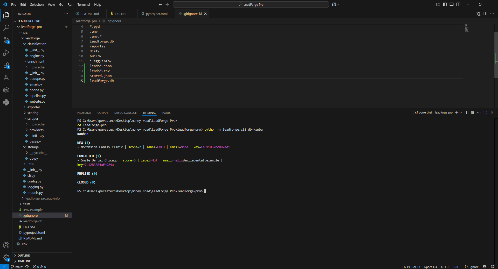

🚀 LeadForge Pro

Business Lead Intelligence Engine (CLI-first CRM)

Scrape → Enrich → Score → Track → Follow-up
A local-first Lead Intelligence & CRM engine built in Python.

📌 What is LeadForge Pro?

LeadForge Pro is a CLI-based business lead intelligence system that allows you to:

Scrape business leads

Enrich contact data

Score & classify leads

Store everything in a local SQLite CRM

Track outreach & follow-ups

Export reports and calendar reminders

Built for freelancers, agencies, sales teams, and developers who want full control over their lead pipeline.

✨ Core Features
🔍 Lead Collection

Mock provider (for testing)

Places API ready (plug-in based architecture)

Modular scraper system

🧠 Lead Intelligence

Email enrichment

Phone normalization (E.164)

Website validation

Deduplication

Scoring engine

HOT / COLD classification

🗂 Local CRM (SQLite)

Status tracking (new / contacted / replied / closed)

Owner assignment

Tag system

Notes per lead

Follow-up scheduling

Kanban-style CLI view

Bulk operations

📊 Sales Insights

DB statistics

Category breakdown

Owner analytics

Tag analytics

Average score / rating

HOT lead ratio

📆 Follow-up Automation

Schedule next follow-up (+hours)

List due follow-ups

Export .ics calendar file

Import into Google Calendar

📦 Export System

CSV export

JSON export

Markdown sales bundle

Report summaries

🛠 Tech Stack

Python 3.10+

Typer (CLI framework)

Pydantic v2

SQLite (local-first storage)

Rich (terminal UI)

httpx

Phonenumbers

⚡ Quickstart
Install (editable mode)
pip install -e .
Initialize Database
python -m leadforge.cli db-init
Run Full Pipeline
python -m leadforge.cli pipeline \
  --keyword "dentist" \
  --location "Chicago" \
  --limit 20 \
  --run-id demo-001 \
  --save-db
View Leads
python -m leadforge.cli db-list --limit 50 --table
Kanban View
python -m leadforge.cli db-kanban
Schedule Follow-up
python -m leadforge.cli db-followup-set --key <LEAD_KEY> --hours 48
Export Calendar
python -m leadforge.cli db-export-ics --output reports/followups.ics
🧩 Architecture
Scraper → Enrichment → Scoring → Classification
                ↓
             SQLite CRM
                ↓
     Reports / Kanban / Follow-ups

Modular structure allows:

Adding new providers

Custom scoring logic

External integrations

SaaS upgrade path

💼 Use Cases

Freelancers selling marketing services

Agencies building prospect lists

Sales teams tracking outreach

Developers building lead tools

Data automation projects

🌍 SaaS Upgrade Ready

LeadForge Pro is built with a modular architecture.

It can be upgraded into:

FastAPI backend

Web dashboard

Multi-user CRM

Stripe subscription system

Cloud database

Hosted SaaS product

If you need a SaaS version, contact for custom development.

🧠 Roadmap

 Web dashboard (FastAPI + React)

 Multi-user support

 Email automation integration

 AI-powered lead scoring

 CRM API endpoints

 SaaS deployment template

🏷 Version

Current Version: 0.3.0

🤝 Freelance & Custom Work

This project is available for:

Custom lead generation tools

CRM systems

SaaS development

Automation scripts

Data scraping solutions
## 📸 Demo

📩 Available for freelance projects.# leadforge-pro
